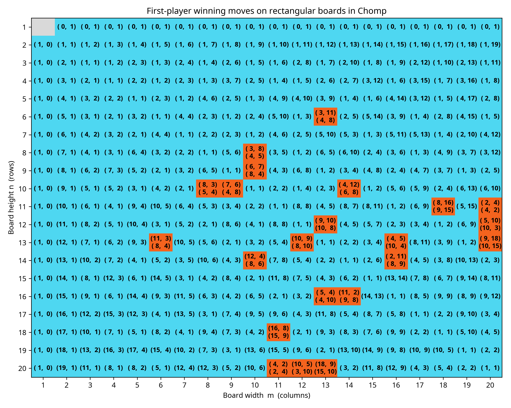

# Chomp 必勝手列挙

2D Chomp の全長方形盤面 (最大 20×20) に対し、初手の先手必勝手を完全列挙するプログラムです。
メモ化 Negamax + αβ 枝刈り + Ferrers 図形ハッシュで探索します。

## 使い方

```bash
# リポジトリをクローン
git clone https://github.com/kitatai/chomp-memoized-search.git
cd chomp-memoized-search

# ビルド
mkdir build && cd build
cmake .. -DCMAKE_BUILD_TYPE=Release
cmake --build .

# 実行して結果をファイルへ出力
./chomp_enum > results.txt
```

## 探索結果



先手必勝手が 3 つ以上存在する 20×20 以下の長方形盤面は存在しないことがわかりました。
